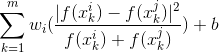

# Varifying Faces In Paired Images <!-- (https://gist.github.com/prats226/d3da93412fef04e3b55b85fed56839e5) -->
 - A transfer learning for verifying faces in pair of images. 

## Objective:
 * Take a pair of images and predict with what probability the images belong to the same person or a different person.

## Approach

 * Use state-of-the-art (SOTA) pre-trained CNN network to extract image representation/embedding which in way gives better initial representation for images.
 
 * For this task pre-trained [InceptionResnet](https://github.com/timesler/facenet-pytorch) is used, that has been trained to classify faces of more than 10K people, thus making it more suitable for this task.
 
 * With image embedding extracted from pre-trained network one can go various ways to solve the problem such as classification for differentiating paired images, or a thresholded gap in distance space or some notion of distance. Nonetheless, given the limited time I took the approach of solving this as a classification problem which a bit fast and is also effective.

 * Furthermore, image representation is precomputed and stored on disk to avoid computation at training time. While this clearly has advantages but restricts us in training the layers of the CNN network (used for extraction) which can prove to be more effective in obtaining a better model.

 * To solve the task the representation from pair of images can be concatenated on top of that a logistic regression, or a  better approach is using elementwise-difference which can inform better about similarity or difference of two images.

 * Even further, a better approach is presented by Taigman et al. ([Deep Face: Closing the Gap to Human-Level Performance in Face Verification](https://www.cs.toronto.edu/~ranzato/publications/taigman_cvpr14.pdf)) is to use chi-square similarity:
   
   - which is element-wise operation where square of difference is reduced by factor of sum of corresponding element in vector representation: `\sum_{k=1}^{m} w_i (\frac{|f(x^i_k) - f(x^j_k)|^2}{f(x^i_k) + f(x^j_k)}) + b`: 

   - 

 * With this approach we further detail the network architecture, training and inference method.

## Data Preparation and Preprocessing

 * [Labeled Faces in Wild](http://vis-www.cs.umass.edu/lfw/) page has more than 13000 images for training on task. For the task, we need a pair of images that are either of the same person or of different ones. The site provides a randomly split dataset for training and testing. 

 * Using these files a dictionary is constructed which stores pairs of names for the same or different person, and also comma-separated values are stored for each image with its name. 

 * Although the available resources only give the split between train and test, a dev-set is also created for monitoring performance during training. Overall the problem has 2048 images for training, 76 for development, and 1000 for testing, which is evenly split between same vs different.

 * The same person pair of images are labeled (`0`) and of different persons are labeled (1).

## Model Architecture

 * With the representation precomputed the problem is solved using a few layers deep linear network with added non-linearity between layers (`models.py`).

 * The model architecture is few-layer deep with initial upsampling and then downsampling that finally outputs a neuron-unit which is used to compute loss using binary-cross entropy loss.

## Training

 * The training starts with sanity check where only hundred of pairs of images are used to overfit the model to make sure that network can learn to overfit.

 * To find a good learning rate for training [one-cycle policy](https://arxiv.org/abs/1803.09820) is used, though, not very much needed here given the network is small, nevertheless, still useful for faster iteration of training processes. 

 * For generalization different regularization techniques are used- weight-decay, dropouts etc. 

 * Data-augmentation has not been used here as a regularization technique given the constraints on resources and limited time.

## Results

* Following are the results obtained on dev and test sets:
<!-- https://www.tablesgenerator.com/markdown_tables -->
| Dataset  (Same/Diff) | F1-score | AUC  |
|----------------------|----------|------|
| Dev (76/76)          | 0.74     | 0.80 |
| Test (500/500)       | 0.71     | 0.73 |

* Although, results are showing good signs and indicate that this `InceptionResnet` can be used for representation for this task, however, the problem needs to explore other available pre-trained models to improve performance further.

## Inferring

 * To run inference task please install the dependency listed in `requirements.txt` file by executing following command in your pc terminal prompts from project-directory

   - $ `pip install -r requirements.txt`.

 *  To infer if two images are of the same person or not from the command line run following from project directory:

   - `python predictor.py -i1 <fullpath to first image> -i2 <fullpath to second image>` 

   - The inference from the model will give whether the pair of images are of one person or of a different person. Along with this, a probability is also given, where 0 indicating the same person and 1 indicating a different person. 

## Conclusion

 * This task showed that one can very efficiently use the pre-trained network for feature extraction and then can use as per need and one's requirement.  

 * Pretrained network can really expedite the process of ML model development on a completely new task. Moreover, with a small number of dataset one can achieve state-of-the-art results. 

## Future works

 * As indicated earlier precomputed features are used for this task which is restrictive in a way that we don't leverage the architecture of the pre-trained network to unfreeze a few of the penultimate layers and traine them as per our task. This step alone can boost performance further.
 
 * Data-augmentation techniques such as flipping, rotating, color-coding, salting, etc. can be not explored given the limited amount to data.
 
 * Explore other techniques different from solving as a classification problems. 

 * Use ensemble model either from model saved at different epochs/milestone metric, or models learned using different algorithm.  

